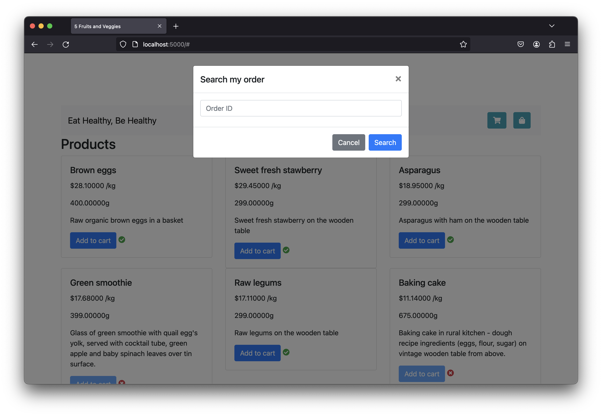
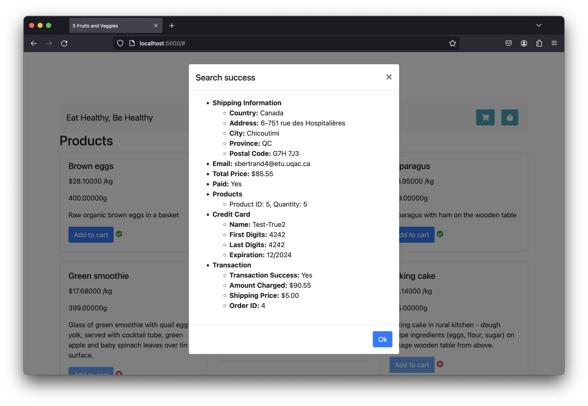

# UQAC_API

L'objectif du projet de session est de développer et déployer une application Web responsable du paiement de commandes Internet.

Le projet consiste à développer une application Web responsable de prendre des commandes Internet. Cette application devra répondre à une API REST, mais devra également être utilisée à travers des pages HTMLs.

##

### Équipe

- [Nolwenn TREUST]()
- [Sophie BERTRAND]()

##

```
.
├── Dockerfile
├── README.md
├── docker-compose.yml
├── img
│   ├── cart_empty.png
│   ├── cart_fill.png
│   ├── landing_page.png
│   ├── order_failed.png
│   ├── order_success.png
│   ├── payment.png
│   ├── shipping.png
│   └── test_cov.png
├── inf349.py
├── orders_products
│   ├── __init__.py
│   ├── models.py
│   ├── services.py
│   └── view.py
├── postgresql.conf
├── requirements.txt
├── static
│   ├── css
│   │   └── style.css
│   └── js
│       └── script.js
├── templates
│   └── index.html
└── tests
    ├── conftest.py
    ├── test_functionnal.py
    ├── test_integration.py
    └── test_unit.py

8 directories, 25 files
```

##

### Exigences

- Python 3.6+
- Flask 1.11+
- peewee 3.17
- pytest 8.1.1
- pytest-cov 4.1.0
- selenium 4.1.0
- requests 2.26.0
- redis 5.0.3
- rq 1.16.1
- psycopg2 2.9.9

Utilisation de la librairie _requests_ à la place de _urllib_ pour l'API.

##

### Démarrer le projet

Lancement des services du docker-compose

```bash
docker compose up -d
```

Construction de l'image Docker de l'application

```bash
docker compose build -t api8inf349 .
```

Lancement de l'image Docker de l'application

```bash
docker run --network=uqac_api_app-network api8inf349:latest -d
```

Initialisation de la base de données

```bash
docker exec -it <api8inf349_container_id> flask init-db
```

Lancement du worker Redis

```bash
docker exec -it <api8inf349_container_id> rq worker
```

Accès à l'application

```
http://locahost:5000
```

##

### Screenshots







