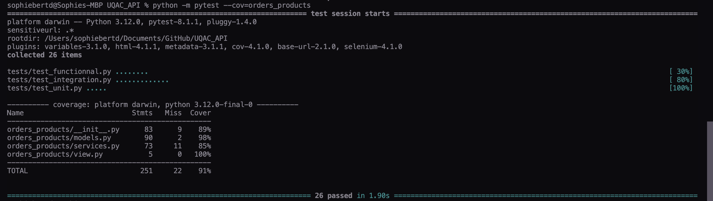
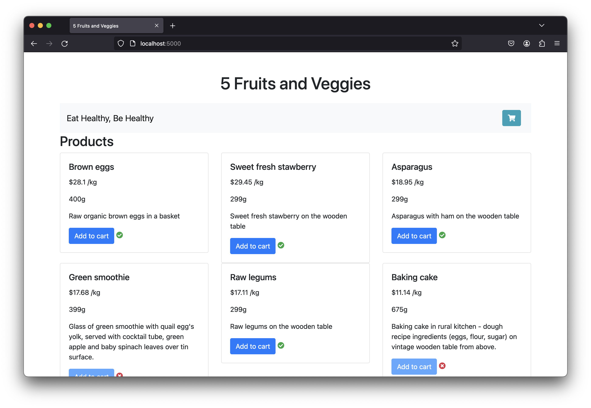
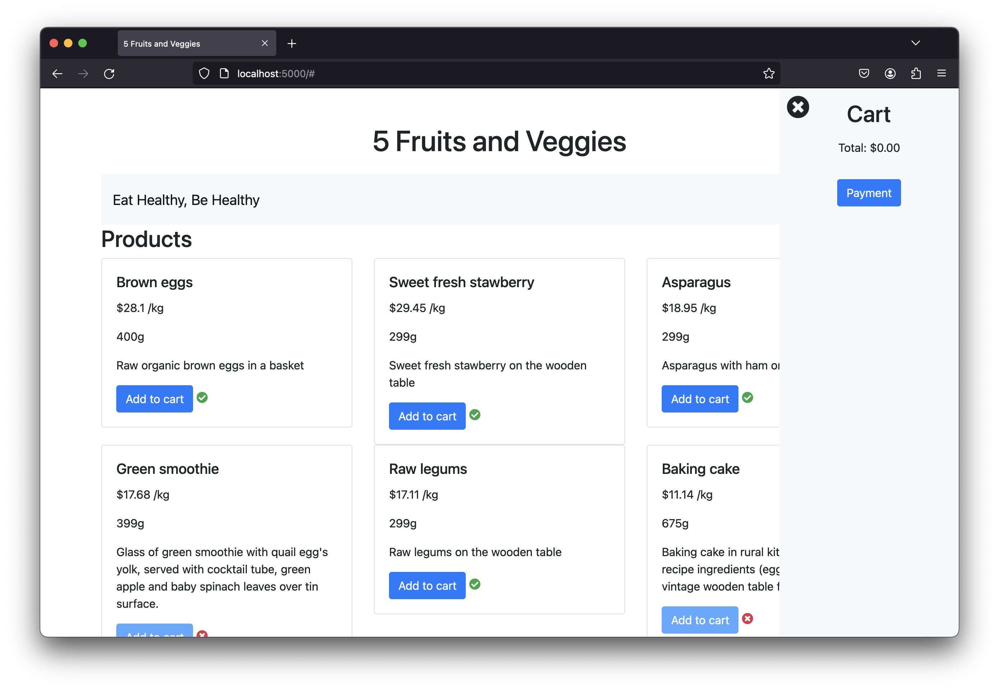
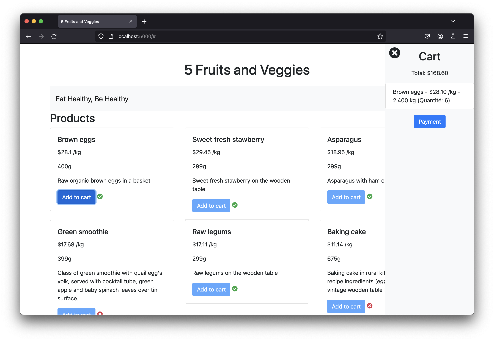
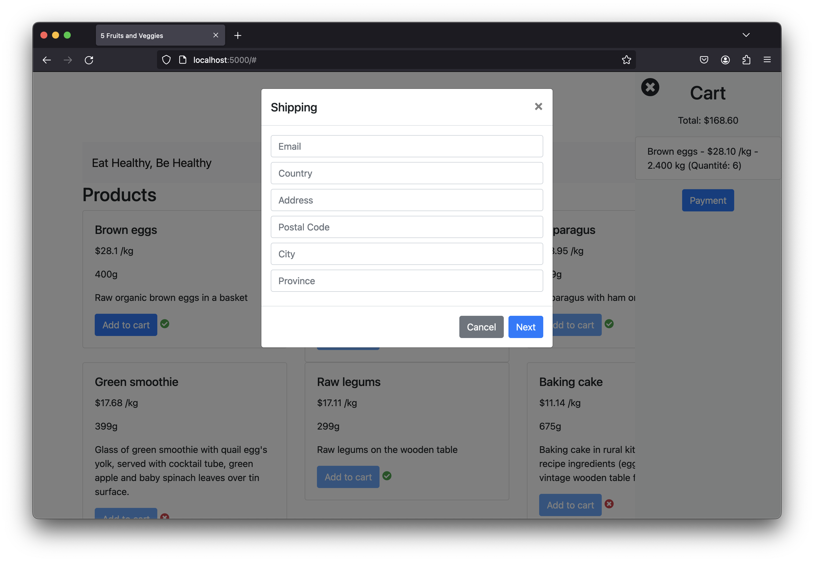
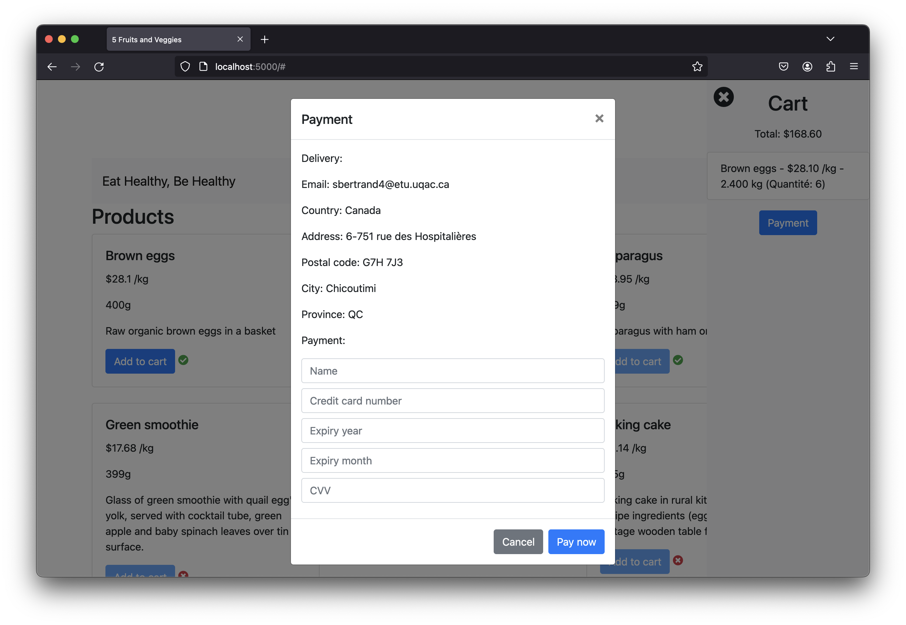
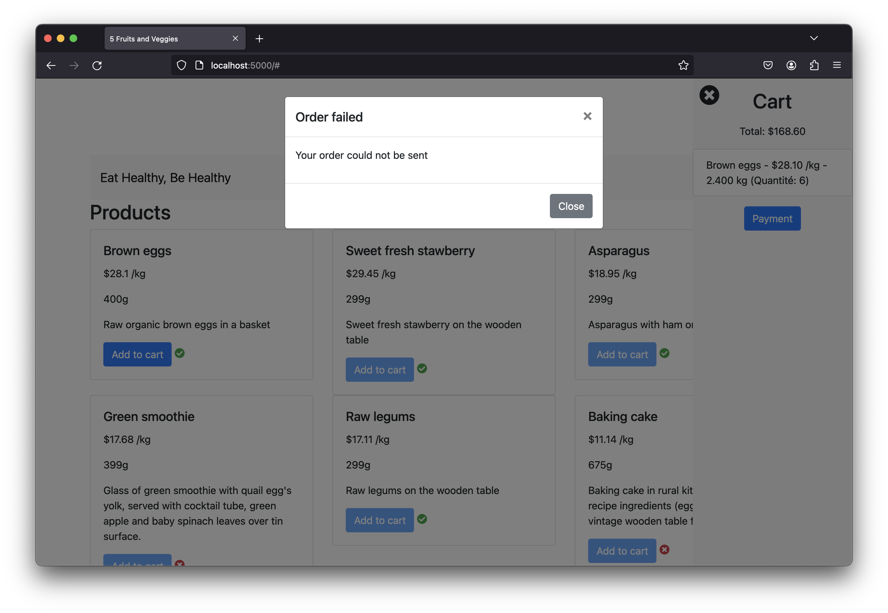

# UQAC_API

L'objectif du projet de session est de développer et déployer une application Web responsable du paiement de commandes Internet.

Le projet consiste à développer une application Web responsable de prendre des commandes Internet. Cette application devra répondre à une API REST, mais devra également être utilisée à travers des pages HTMLs.

##

```
.
├── README.md
├── htmlcov
│   ├── coverage_html.js
│   ├── d_869ccebe1c6d09d3___init___py.html
│   ├── d_869ccebe1c6d09d3_models_py.html
│   ├── d_869ccebe1c6d09d3_services_py.html
│   ├── d_869ccebe1c6d09d3_view_py.html
│   ├── favicon_32.png
│   ├── index.html
│   ├── keybd_closed.png
│   ├── keybd_open.png
│   ├── status.json
│   └── style.css
├── img
│   ├── cart_empty.png
│   ├── cart_fill.png
│   ├── landing_page.png
│   ├── order_failed.png
│   ├── order_success.png
│   ├── payment.png
│   ├── shipping.png
│   └── test_cov.png
├── inf349.py
├── instance
│   └── database.sqlite
├── orders_products
│   ├── __init__.py
│   ├── models.py
│   ├── services.py
│   └── view.py
├── static
│   ├── css
│   │   └── style.css
│   └── js
│       └── script.js
├── templates
│   └── index.html
└── tests
    ├── conftest.py
    ├── test_functionnal.py
    ├── test_integration.py
    └── test_unit.py

10 directories, 33 files
```

##

### Exigences

- Python 3.6+
- Flask 1.11+
- peewee 3.17
- pytest 8.1.1
- pytest-cov 4.1.0
- selenium 4.1.0

Utilisation de la librairie _requests_ à la place de _urllib_ pour l'API.

##

### Démarrer le projet

Initialisation de la base données:

```bash
FLASK_DEBUG=True FLASK_APP=inf349 flask init-db
```

Lancement du serveur Flask

```bash
FLASK_DEBUG=True FLASK_APP=inf349 flask run
```

##

### Tests

```bash
python -m pytest --cov=orders_products
```

ou

```bash
python -m pytest --cov-report=html --cov=orders_products
```

##

### Screenshots















